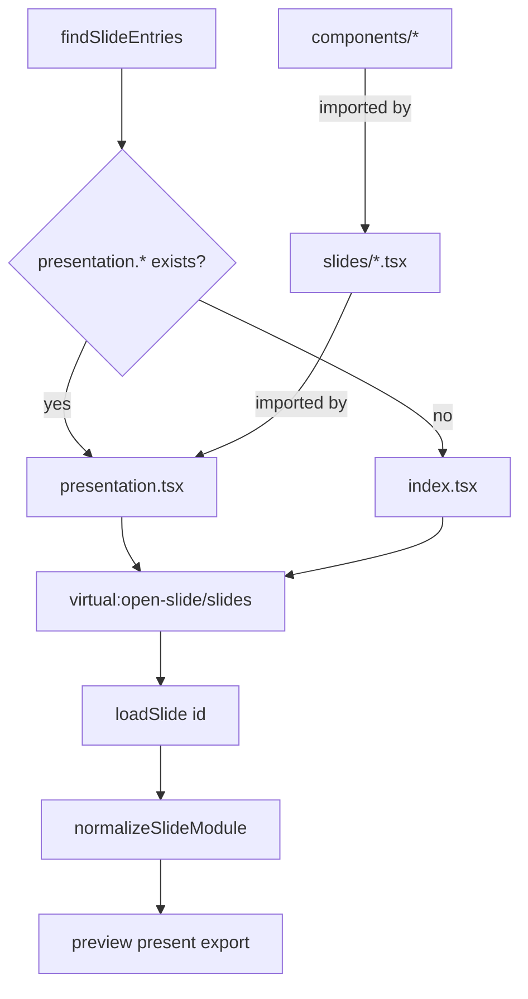

# Modular presentation decks (`presentation.tsx`)

## Architecture found

Open-Slide already treats each **deck** as `slides/<deckId>/` with a single module (`SlideModule`):

```ts
// packages/core/src/app/lib/sdk.ts
export type SlideModule = {
  default: Page[];           // page order = array order
  meta?: SlideMeta;
  design?: DesignSystem;
  notes?: (string | undefined)[];  // index-aligned
  transition?: SlideTransition;
};
```

- **Discovery**: Vite plugin globs `slides/*/index.{tsx,jsx,ts,js}` ([`open-slide-plugin.ts`](packages/core/src/vite/open-slide-plugin.ts)); deck id = folder name.
- **Page identity**: array index only (`?p=`, notes, presenter). No page UUIDs.
- **Comments / visual edits**: assume one file — APIs always open `index.tsx` ([`resolveSlideEntry`](packages/core/src/editing/slide-ops.ts), [`comments.ts` routes](packages/core/src/vite/routes/comments.ts), [`edit.ts`](packages/core/src/vite/routes/edit.ts)). Loc-tags already transform any nested `.tsx` under a deck, but `data-slide-loc` stores only `line:column` (ambiguous across files).
- **Authoring skills today forbid** sibling `.tsx` / `components/` ([`slide-authoring/SKILL.md`](packages/core/skills/slide-authoring/SKILL.md)).
- **CLI template**: monolithic [`getting-started/index.tsx`](packages/cli/template/slides/getting-started/index.tsx).

## Design to implement

Keep the **same public `SlideModule` shape**. Do **not** add `definePresentation` (no material type-safety gain over `export default […] satisfies Page[]` + existing named exports).

Map the requested layout onto the existing deck folder:

```text
slides/<deck-id>/
├── presentation.tsx      # SlideModule entry (preferred)
├── slides/               # one Page per file (NOT discovered as decks)
│   ├── slide_01.tsx
│   └── slide_02.tsx
├── components/           # shared UI / theme — never treated as slides
│   ├── header.tsx
│   ├── footer.tsx
│   └── theme.ts
└── assets/
```

```tsx
// presentation.tsx — same contract as today's index.tsx
import type { Page, SlideMeta } from '@open-slide/core';
import { Slide01 } from './slides/slide_01';
import { Slide02 } from './slides/slide_02';

export const meta: SlideMeta = { title: '…', createdAt: '…' };
export const notes = ['…', undefined];
export default [Slide01, Slide02] satisfies Page[];
```

### Precedence (deterministic)

For each `slides/<id>/` folder:

1. If `presentation.{tsx,jsx,ts,js}` exists → that is the entry.
2. Else if `index.{tsx,jsx,ts,js}` exists → legacy entry.
3. If **both** exist → use `presentation.*`, emit a one-time Vite warning.
4. Nested `slides/` / `components/` are never deck roots (discovery stays one level deep for entries only).

### Stable identity (no new page-ID API)

- **Comments** move with the page component file when the `default` array is reordered → stable without IDs.
- **Notes / `?p=` / presenter** stay index-aligned (existing behavior). UI reorder APIs already permute `notes` with `default`; document that manual reorders in `presentation.tsx` must keep `notes` aligned.
- Do **not** introduce page UUID exports in this change.

### Canonical helpers (shared by plugin, slide-ops, routes)

Add something like [`packages/core/src/editing/slide-entry.ts`](packages/core/src/editing/slide-entry.ts) (or extend `slide-ops.ts`):

- `ENTRY_NAMES = ['presentation', 'index']` + extensions
- `resolveSlideEntry(slidesRoot, slideId)` → absolute path or null (presentation first)
- `findSlideEntries(slidesRoot)` → list of entry paths for the virtual module
- `isUnderSlideDir(slidesRoot, filePath)` → deck id for HMR / watcher
- `resolveSlideSourceFile(slidesRoot, slideId, relFile?)` → safe path under the deck for comments/edits (default = entry)

Wire every hardcoded `index.tsx` path through these helpers (plugin, duplicate/rename, notes, design, comments, edit, assets, current-plugin, UI copy).

### HMR

Broaden `slideIdForEntry` so **any** file under `slides/<id>/**` maps to that deck id (not only `*/index.tsx`). Entry add/unlink still full-reloads the slides virtual module; in-deck edits keep the existing `open-slide:slide-changed` path. Vite’s import graph loads page/component modules via normal dynamic `import()` of the entry — no custom scanners for `components/`.

### Runtime validation

In `useSlideModule` (or a small `normalizeSlideModule`):

- `default` missing / not an array → clear error
- empty `default` → clear empty-deck error
- non-function page entries → error naming the index

### Multi-file inspector (required for split pages)

Loc-tags already hit nested `.tsx`; fix the missing file identity:

1. Inject `data-slide-loc="<rel-from-deck>:<line>:<col>"` (e.g. `slides/slide_01.tsx:40:2`).
2. Extend `findSlideSource` / selection types to return `file` (deck-relative).
3. Comments + edit + image-placeholder APIs accept optional `file`; validate under deck; default to entry for backward compatibility.
4. `GET /__comments` aggregates markers from all `.tsx` under the deck (skip `node_modules`, tests).
5. Fiber fallback: match any path under `/slides/<slideId>/`, not only `index.tsx`.

### CLI scaffold

Replace the monolithic template deck with a **small modular** `getting-started` that runs out of the box:

- `presentation.tsx` + `slides/slide_01.tsx` + `slides/slide_02.tsx`
- `components/header.tsx`, `components/footer.tsx`, `components/theme.ts`
- Keep `assets/` if still referenced; otherwise drop unused SVGs

Update [`packages/cli/template/AGENTS.md`](packages/cli/template/AGENTS.md).

**Migration scope default:** do **not** convert all 19 `apps/demo` decks in this PR (large unrelated diff). Leave them on `index.tsx` as live backward-compat proof. Add a modular e2e fixture instead.

### Skills + docs

Canonical skills under [`packages/core/skills/`](packages/core/skills/) (synced into CLI template on build):

- Invert the “single index.tsx only” rule → prefer modular layout; allow legacy `index.tsx`
- `create-slide`: scaffold `presentation.tsx` + `slides/` + `components/`
- `slide-authoring`: file contract, ordering, theme tokens in `components/theme.ts` or `export const design` on entry, stable notes alignment, verify shared components across pages
- Docs: [`slide-meta.mdx`](apps/web/content/docs/reference/slide-meta.mdx), getting-started, create-slide / slide-authoring skill pages, CLI init

### Tests

| Area | Where |
| --- | --- |
| Discovery prefers `presentation.tsx`; ignore nested files as decks | `open-slide-plugin.test.ts` |
| Entry resolution + duplicate with presentation | `slide-ops.test.ts` |
| Order from `default` array; components not slides | unit + e2e fixture |
| Invalid / empty export | unit around normalize helper |
| Comments/edits with `file` param; loc-tag format | `loc-tags-plugin.test.ts`, comments tests, fiber tests |
| Legacy `index.tsx` still loads | existing fixtures unchanged |
| CLI template shape | extend `init` / template assertions if present; typecheck template |
| Build includes modular fixture | e2e `build.spec.ts` or plugin generate test |

Add e2e fixture e.g. `packages/core/e2e/fixture/slides/modular/` with `presentation.tsx` + nested slides/components.

### Changesets

`patch` or `minor` for `@open-slide/core` (new entry + multi-file loc) and `@open-slide/cli` (template). Short present-tense descriptions.



## Main files to change

- [`packages/core/src/vite/open-slide-plugin.ts`](packages/core/src/vite/open-slide-plugin.ts) — discovery + HMR
- [`packages/core/src/editing/slide-ops.ts`](packages/core/src/editing/slide-ops.ts) (+ new entry helper)
- [`packages/core/src/vite/routes/context.ts`](packages/core/src/vite/routes/context.ts), comments, edit, design, notes, current-plugin
- [`packages/core/src/vite/loc-tags-plugin.ts`](packages/core/src/vite/loc-tags-plugin.ts) + inspector fiber / use-comments / use-editor
- [`packages/core/src/app/lib/use-slide-module.ts`](packages/core/src/app/lib/use-slide-module.ts) — validation
- CLI template + `AGENTS.md`
- Skills under `packages/core/skills/**`
- Docs under `apps/web/content/docs/**`
- Tests + e2e fixture + changeset

## Out of scope / limitations to accept

- No automatic migration of existing monolithic decks.
- No page-level UUID / URL slug system.
- `apps/demo` stays on `index.tsx` unless you later ask to migrate examples.
- Notes remain index-aligned on the entry file (not per slide file).
